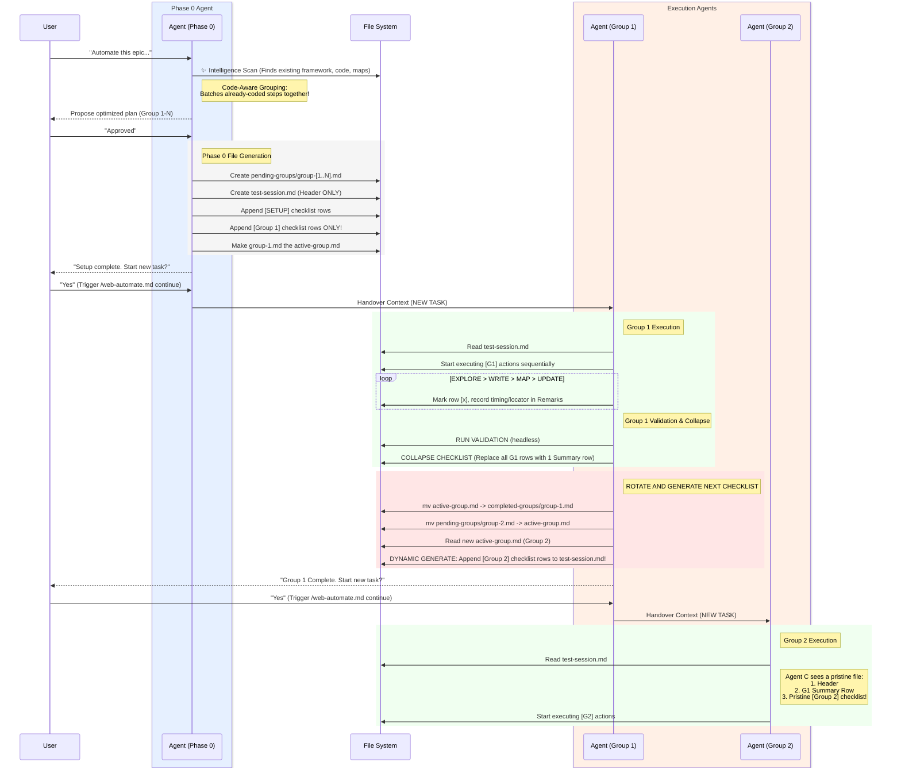

# Stateless Architecture Flow (Dynamic Checklist Generation)

This sequence diagram illustrates how the architecture manages state, keeps `test-session.md` small, and handles agent handover.

### Key Features
1. **No upfront massive checklist:** The `Phase 0 Agent` explicitly does **not** generate the checklist for Group 2 or beyond.
2. **Context stays tiny:** `COLLAPSE CHECKLIST` turns the old 20+ rows of Group 1 into a single 1-line `SUMMARY` row containing only the extracted page maps and locators (for Phase 3's POM refactoring). 
3. **The Rotation Heartbeat:** The crucial moment happens in the red block when the exhausted `Group 1 Agent` rotates the files, reads what `Group 2` is supposed to be, and dynamically generates the `[Group 2]` checklist rows *just before* pulling the ripcord to spawn the fresh `Group 2 Agent`.
4. **Pristine Wakeup:** When the `Group 2 Agent` spawns, it looks at `test-session.md` and only sees the Header, the single Summary row from G1, and the pristine rows it needs to execute for G2.
