# Workflow Diagrams

Direct system diagrams for the hardened Web Automation Pro contract.

These diagrams reflect the intended operating model defined in:
- [`REQUIREMENTS.md`](./REQUIREMENTS.md)
- [`.postqode/skills/web-automation-pro/SKILL.md`](./.postqode/skills/web-automation-pro/SKILL.md)
- [`.postqode/workflows/automate.md`](./.postqode/workflows/automate.md)
- [`.postqode/workflows/finalize.md`](./.postqode/workflows/finalize.md)
- [`.postqode/skills/web-automation-pro/references/session-protocol.md`](./.postqode/skills/web-automation-pro/references/session-protocol.md)

---

## 1. Whole System

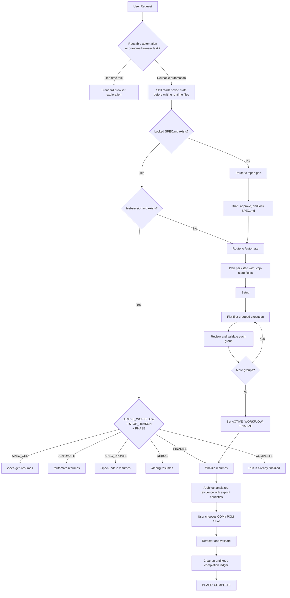

---

## 2. Skill Orchestrator Routing

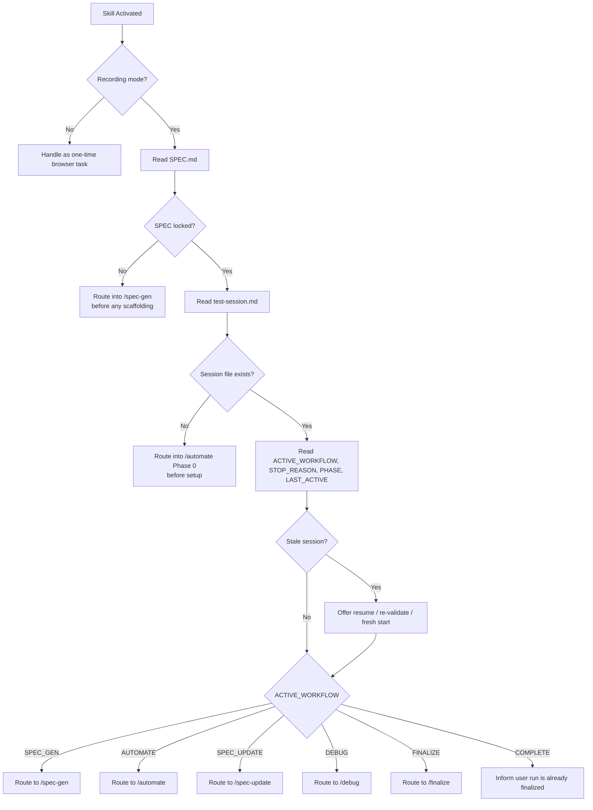

---

## 3. `/spec-gen` Flow

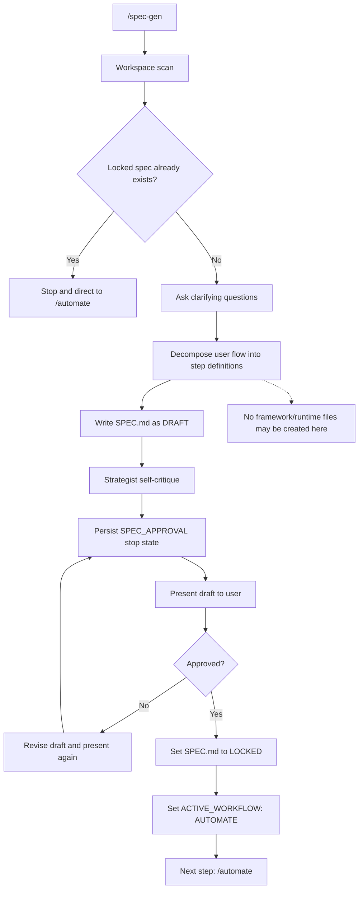

---

## 4. `/automate` State Flow

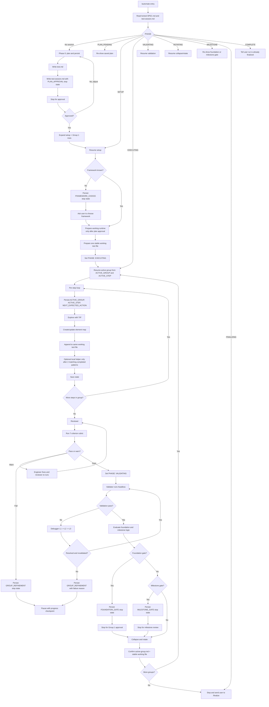

---

## 5. Per-Group Execution Detail

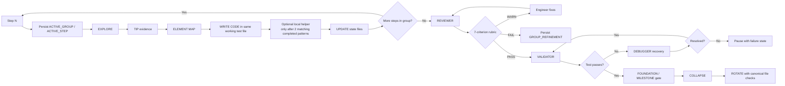

---

## 6. Architecture Timing Model

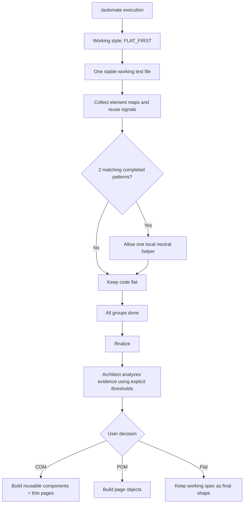

---

## 7. `/finalize` Flow

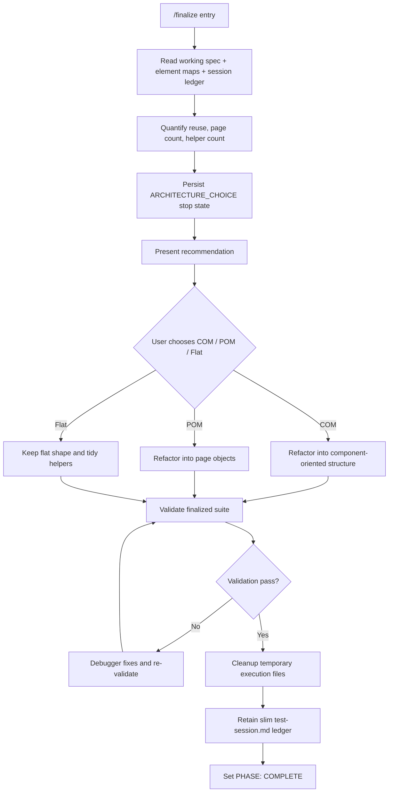

---

## 8. Resume and Stale Session Situations

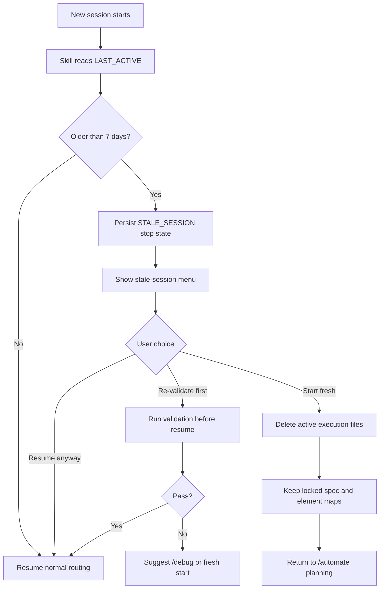

---

## 9. Failure Handling Situations

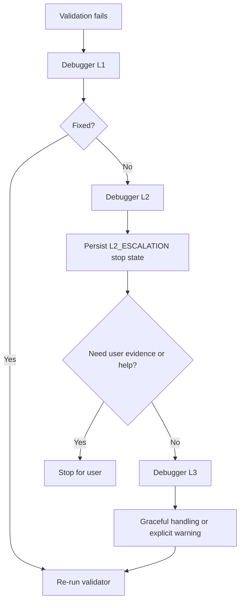

---

## 10. Persona Activation Overview

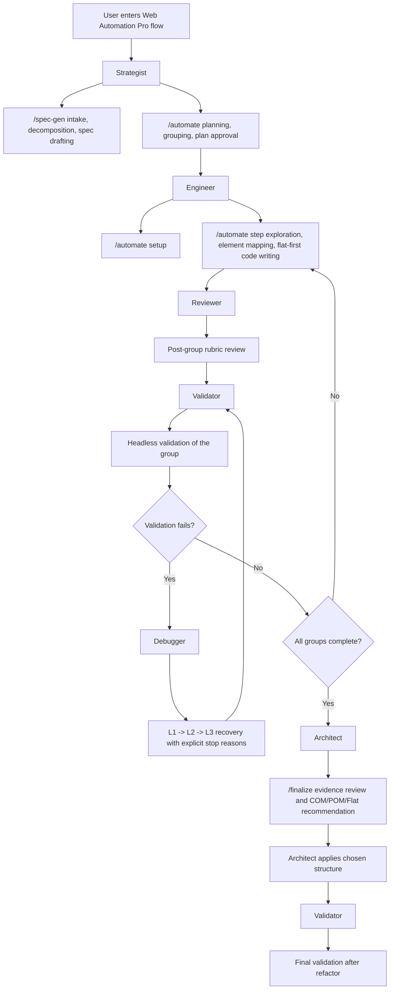

---

## 11. Persona-by-Workflow Map

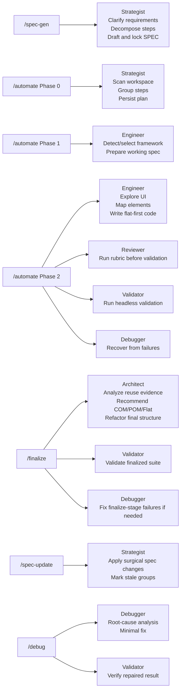

---

## 12. Persona Responsibilities

```mermaid
flowchart TD
    A["Strategist"] --> A1["Owns clarity"]
    A --> A2["Creates and updates the spec contract"]
    A --> A3["Builds persisted plans and approval stops"]

    B["Engineer"] --> B1["Owns setup and execution"]
    B --> B2["Explores one step at a time"]
    B --> B3["Writes flat-first evidence-based code"]

    C["Reviewer"] --> C1["Owns pre-validation quality gate"]
    C --> C2["Checks 7-criterion rubric"]
    C --> C3["Flags issues but does not fix them"]

    D["Validator"] --> D1["Owns actual test execution"]
    D --> D2["Reports pass/fail facts"]
    D --> D3["Validates groups and finalized output"]

    E["Debugger"] --> E1["Owns failure recovery"]
    E --> E2["Uses L1 -> L2 -> L3 escalation"]
    E --> E3["Persists escalation stop reasons before asking for help"]

    F["Architect"] --> F1["Owns final structure"]
    F --> F2["Analyzes reuse evidence from element maps"]
    F --> F3["Implements COM, POM, or Flat in /finalize"]
```

---

## Reading Order

If someone wants the system from top to bottom, the best order is:

1. Whole System
2. Skill Orchestrator Routing
3. `/spec-gen`
4. `/automate` State Flow
5. Per-Group Execution Detail
6. Architecture Timing Model
7. `/finalize`
8. Resume and Stale Session Situations
9. Failure Handling Situations
10. Persona Activation Overview
11. Persona-by-Workflow Map
12. Persona Responsibilities
